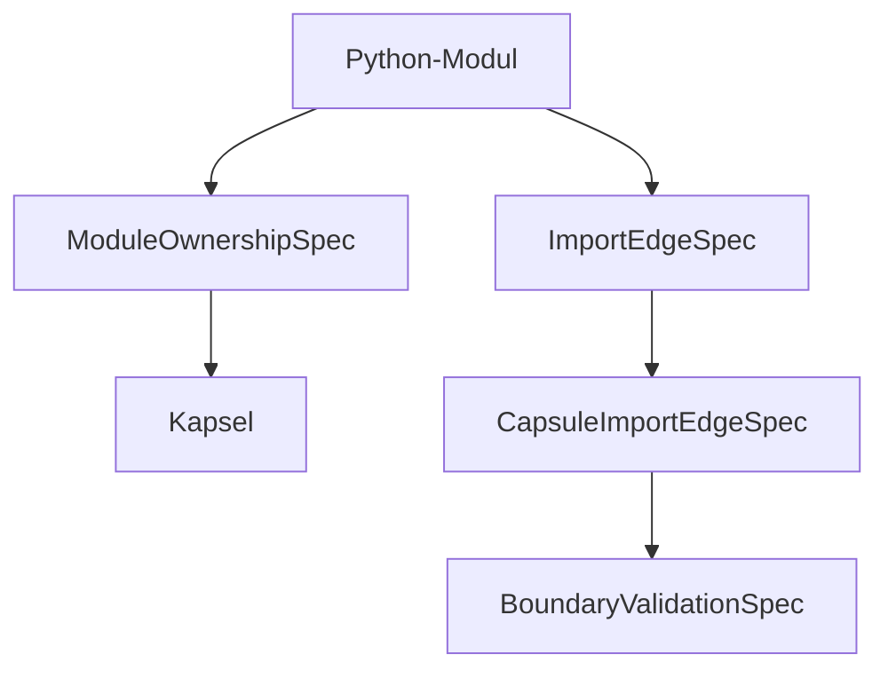

# Reta Stage-32 Architektur-Grenzen

## Boundary-Baum

```text
ArchitectureBoundariesBundle
├─ ModuleOwnershipSpec: Python-Datei → Kapsel
├─ ImportEdgeSpec: Python-Import → Morphismus
└─ CapsuleImportEdgeSpec: Kapsel → Kapsel Boundary-Kante
```

## Mermaid


