# Reta Stage-40 Architektur-Kohärenz

## Kohärenzbaum

```text
ArchitectureCoherenceBundle
├─ capsule_coherence_matrix
│  ├─ every capsule → category → functor/natural transformation → contract → witness
│  └─ old reta surfaces remain compatibility entrances, not semantic owners
├─ functorial_route_matrix
│  ├─ architecture-map flows classified as functors or natural transformations
│  └─ each route points to a Stage-29 diagram and Stage-30 witness
├─ naturality_coherence_matrix
│  └─ every natural transformation is tied to diagrams, capsules and witness anchors
├─ law_coherence_matrix
│  └─ every refactor law has a witness obligation
├─ impact_gate_coherence_hint
│  └─ Stage-33 impact sources and migration candidates are checked by ArchitectureImpactBundle
├─ migration_plan_coherence_hint
│  └─ Stage-34 migration waves, Stage-35 rehearsals, Stage-36 activation transactions, Stage-37 row-range activation and Stage-38 arithmetic activation and Stage-39 console/io activation and Stage-40 word-completion activation and Stage-41 nested-completion activation are checked by ArchitectureMigrationBundle / ArchitectureRehearsalBundle / ArchitectureActivationBundle / RowRangeMorphismBundle / ArithmeticMorphismBundle
└─ validation
   └─ cross-layer gaps are reported before a later extraction is accepted
```

## Mermaid

```mermaid
flowchart TD
    Cat[CategoryTheoryBundle<br/>categories / functors / natural transformations]
    Map[ArchitectureMapBundle<br/>capsules / flows / stage map]
    Contracts[ArchitectureContractsBundle<br/>diagrams / laws]
    Witness[ArchitectureWitnessBundle<br/>anchors / slices / obligations]
    Coherence[ArchitectureCoherenceBundle<br/>Stage 31 coherence matrix]
    Cat --> Coherence
    Map --> Coherence
    Contracts --> Coherence
    Witness --> Coherence
    Coherence --> Capsule[Capsule coherence<br/>what owns what]
    Coherence --> Routes[Functorial routes<br/>how data moves]
    Coherence --> Natural[Naturality coherence<br/>which diagrams commute]
    Coherence --> Laws[Law coherence<br/>what future stages must keep true]
    Coherence --> Impact[Impact coherence<br/>trace + boundary routes expose gates]
    Coherence --> Migration[Migration coherence<br/>impact candidates become gated waves]
    Coherence --> Activation[Activation coherence<br/>rehearsed moves become commit/rollback transactions]
    Coherence --> Arithmetic[Arithmetic coherence<br/>center arithmetic delegates to activated morphisms]
    Coherence --> ConsoleIO[Console-IO coherence<br/>center help/output utilities delegate to activated morphisms]
    Coherence --> WordCompletion[Word-completion coherence<br/>word_completerAlx delegates to activated morphisms]
    Coherence --> NestedCompletion[Nested-completion coherence<br/>nestedAlx delegates to activated morphisms]
```


