# Reta Stage-29 Architekturverträge

## Vertragsbaum

```text
ArchitectureContractsBundle
├─ Commutative diagrams
│  ├─ RawCommandNaturalitySquare
│  ├─ PresheafSheafGluingSquare
│  ├─ UniversalWorkflowTableSquare
│  ├─ GeneratedColumnStateSyncSquare
│  ├─ RuntimeStateProjectionSquare
│  ├─ RenderedOutputParitySquare
│  ├─ LegacyArchitectureCompatibilitySquare
│  ├─ ArchitectureMapContractReflectionTriangle
│  ├─ ValidationWitnessCommutationSquare
│  ├─ CoherenceTraceNavigationSquare
│  ├─ BoundaryImportGraphCommutationSquare
│  ├─ TraceBoundaryImpactSquare
│  ├─ ImpactGateValidationSquare
│  ├─ ImpactMigrationPlanningSquare
│  ├─ MigrationGateCoherenceSquare
│  ├─ MigrationRehearsalSquare
│  ├─ RehearsalReadinessValidationSquare
│  ├─ RehearsalActivationSquare
│  ├─ ActivationRollbackValidationSquare
│  ├─ CenterRowRangeCompatibilitySquare
│  ├─ RowRangeValidationSquare
│  ├─ CenterArithmeticCompatibilitySquare
│  ├─ ArithmeticRowRangeGluingSquare
│  ├─ CenterConsoleIOCompatibilitySquare
│  ├─ ConsoleIOOutputValidationSquare
│  ├─ WordCompleterCompatibilitySquare
│  ├─ WordCompletionValidationSquare
│  └─ NestedCompletionValidationSquare
├─ Capsule contracts
│  ├─ RetaArchitectureRoot
│  ├─ SchemaTopologyCapsule
│  ├─ LocalSectionCapsule
│  ├─ SemanticSheafCapsule
│  ├─ InputPromptCapsule
│  ├─ WorkflowGluingCapsule
│  ├─ TableCoreCapsule
│  ├─ GeneratedRelationCapsule
│  ├─ OutputRenderingCapsule
│  ├─ CompatibilityCapsule
│  └─ CategoricalMetaCapsule
└─ Refactor laws
   ├─ topology / presheaf / sheaf laws
   ├─ universal workflow law
   ├─ generated/state sync law
   ├─ output-normalization law
   ├─ legacy-compatibility law
   ├─ architecture-validation-completeness law
   ├─ architecture-trace / boundary laws
   ├─ architecture-impact-gate law
   ├─ activated-row-range law
   ├─ activated-arithmetic law
   ├─ activated-console-io law
   └─ activated-word-completion law
```

## Mermaid

```mermaid
flowchart TD
    Raw[Raw CLI/Prompt] -->|RawCommandNaturalitySquare| Canonical[Canonical semantic sheaf]
    Local[Local CSV/doc/prompt sections] -->|PresheafSheafGluingSquare| Canonical
    Canonical -->|UniversalWorkflowTableSquare| Table[Global table section]
    Table -->|GeneratedColumnStateSyncSquare| Generated[Generated/enriched state]
    Table -->|RuntimeStateProjectionSquare| State[Explicit TableStateSections]
    Table -->|RenderedOutputParitySquare| Output[Normalized output]
    Legacy[Legacy reta.py/retaPrompt.py/libs] -->|LegacyArchitectureCompatibilitySquare| Output
    Meta[CategoryTheoryBundle + ArchitectureMapBundle] -->|ArchitectureMapContractReflectionTriangle| Contracts[ArchitectureContractsBundle]
    Contracts -->|ContractReferenceValidation| Validated[Validated contracts]
    Witnesses[ArchitectureWitnessBundle] -->|ValidationWitnessCommutationSquare| Validation[ArchitectureValidationBundle]
    Validated -->|ContractWitnessValidationTransformation| Validation
    Migration -->|MigrationRehearsalSquare| Rehearsal[ArchitectureRehearsalBundle]
    Rehearsal -->|RehearsalReadinessValidationSquare| Validation
    Rehearsal -->|RehearsalActivationSquare| Activation[ArchitectureActivationBundle]
    Activation -->|ActivationRollbackValidationSquare| Validation
    Center[libs.center row-range facade] -->|CenterRowRangeCompatibilitySquare| RowRanges[RowRangeMorphismBundle]
    RowRanges -->|RowRangeValidationSquare| Validation
    RowRanges -->|ArithmeticRowRangeGluingSquare| Arithmetic[ArithmeticMorphismBundle]
    Center -->|CenterArithmeticCompatibilitySquare| Arithmetic
    Arithmetic -->|ArithmeticValidationFunctor| Validation
    Center -->|CenterConsoleIOCompatibilitySquare| ConsoleIO[ConsoleIOMorphismBundle]
    ConsoleIO -->|ConsoleIOOutputValidationSquare| Validation
    WordCompletion[WordCompletionMorphismBundle] -->|WordCompletionValidationSquare| Validation
    NestedCompletion[NestedCompletionMorphismBundle] -->|NestedCompletionValidationSquare| Validation
    Center -->|WordCompleterCompatibilitySquare| WordCompletion
    Trace[ArchitectureTraceBundle] -->|TraceBoundaryImpactSquare| Impact[ArchitectureImpactBundle]
    Boundary[ArchitectureBoundariesBundle] -->|TraceBoundaryImpactTransformation| Impact
    Impact -->|ImpactGateValidationSquare| Gates[Regression gates]
    Impact -->|ImpactMigrationPlanningSquare| Migration[ArchitectureMigrationBundle]
    Migration -->|MigrationGateCoherenceSquare| MigrationValidation[Migration validation]
```


