# Reta Stage-42 Gesamtarchitektur

## Kapselbaum

```text
RetaArchitectureRoot
├─ SchemaTopologyCapsule
│  ├─ i18n words_context / words_matrix / words_runtime
│  ├─ RetaContextSchema
│  └─ RetaContextTopology + ContextSelection
├─ LocalSectionCapsule
│  ├─ CSV / docs / translations / prompt raw state
│  └─ PresheafBundle(LocalSection, FilesystemPresheaf, PromptStatePresheaf)
├─ SemanticSheafCapsule
│  ├─ ParameterSemanticsSheaf
│  ├─ GeneratedColumnsSheaf
│  ├─ TableOutputSheaf
│  └─ HtmlReferenceSheaf
├─ InputPromptCapsule
│  ├─ InputBundle + RowRangeSyntax + PromptVocabulary
│  ├─ RowRangeMorphismBundle = activated row-range parser
│  ├─ ArithmeticMorphismBundle = activated center arithmetic
│  ├─ ConsoleIOMorphismBundle = activated center console/help utilities
│  ├─ WordCompletionMorphismBundle = activated word-completion matching
│  ├─ NestedCompletionMorphismBundle = activated hierarchical prompt completion
│  ├─ PromptRuntime + CompletionRuntime + PromptLanguage
│  └─ PromptSession + PromptExecution + PromptPreparation + PromptInteraction
├─ WorkflowGluingCapsule
│  ├─ ParameterRuntime
│  ├─ ColumnSelection
│  ├─ ProgramWorkflow
│  └─ TableGeneration + UniversalBundle
├─ TableCoreCapsule
│  ├─ TableRuntime.Tables = global table section
│  ├─ TableStateSections = explicit mutable sections
│  ├─ TablePreparation + RowFiltering + Wrapping
│  └─ NumberTheory
├─ GeneratedRelationCapsule
│  ├─ GeneratedColumns + MetaColumns
│  ├─ ConcatCsv / fractional CSV gluing
│  └─ KombiJoin
├─ OutputRenderingCapsule
│  ├─ OutputSyntax
│  ├─ OutputSemantics
│  ├─ ConsoleIOMorphismBundle = activated console/help/wrapping output service
│  └─ TableOutput renderers
├─ CompatibilityCapsule
│  ├─ reta.py / retaPrompt.py
│  ├─ libs compatibility facades
│  └─ parity + package integrity
└─ CategoricalMetaCapsule
   ├─ CategoryTheoryBundle
   ├─ ArchitectureMapBundle
   ├─ ArchitectureContractsBundle
   ├─ ArchitectureWitnessBundle
   ├─ ArchitectureCoherenceBundle
   ├─ ArchitectureValidationBundle
   ├─ ArchitectureTraceBundle
   ├─ ArchitectureBoundariesBundle
   ├─ ArchitectureImpactBundle
   ├─ ArchitectureMigrationBundle
   ├─ ArchitectureRehearsalBundle
   └─ ArchitectureActivationBundle
```

## Mermaid

```mermaid
flowchart TD
    Legacy[Legacy surfaces<br/>reta.py / retaPrompt.py / libs] --> Root[RetaArchitectureRoot]
    Root --> Schema[SchemaTopologyCapsule<br/>schema + open contexts]
    Schema --> Presheaf[LocalSectionCapsule<br/>CSV/doc/prompt presheaves]
    Presheaf -->|PresheafToSheafGluingTransformation| Sheaf[SemanticSheafCapsule<br/>canonical semantic sheaves]
    Input[InputPromptCapsule<br/>CLI/prompt raw text] -->|RawToCanonicalParameterTransformation| Sheaf
    Sheaf -->|TableGenerationGluingTransformation| Workflow[WorkflowGluingCapsule<br/>parameter runtime + columns + table generation]
    Workflow --> Table[TableCoreCapsule<br/>Tables + explicit state sections]
    Table -->|GeneratedColumnEndofunctorFamily| Generated[GeneratedRelationCapsule<br/>generated/meta/concat/combi]
    Generated -->|GeneratedColumnsSheafSyncTransformation| Table
    Table -->|OutputRenderingFunctorFamily| Output[OutputRenderingCapsule<br/>shell/md/html/csv/...]
    Output -->|RenderedOutputNormalizationTransformation| Parity[CompatibilityCapsule<br/>legacy parity]
    Legacy -->|LegacyToArchitectureTransformation| Parity
    Meta[CategoricalMetaCapsule<br/>categories/functors/natural transformations/map/laws/witnesses/validation/coherence/traces/boundaries/impact/migration/rehearsal/activation/activated row ranges/arithmetic/console io/nested completion] -. describes .-> Root
    Meta -. describes .-> Schema
    Meta -. describes .-> Sheaf
    Meta -. describes .-> Table
    Meta -. law checks .-> Parity
    Meta -. witness matrix .-> Parity
    Meta -. validation report .-> Root
    Meta -. coherence matrix .-> Root
    Meta -->|CoherenceToTraceFunctor| Root
    Meta -->|CoherenceToBoundaryFunctor| Root
    Meta -->|TraceBoundaryImpactFunctor| Root
    Meta -->|ImpactGateValidationFunctor| Root
    Meta -->|ImpactToMigrationPlanFunctor| Root
    Meta -->|MigrationGateCoherenceFunctor| Parity
    Meta -->|MigrationStepRehearsalFunctor| Root
    Meta -->|MigrationGateRehearsalFunctor| Workflow
    Meta -->|RehearsalCoverFunctor| Schema
    Meta -->|RehearsalGateValidationFunctor| Parity
    Meta -->|RehearsalReadinessCoherenceFunctor| Meta
    Meta -->|RehearsalActivationFunctor| Root
    Meta -->|GateActivationFunctor| Parity
    Meta -->|ActivationTransactionFunctor| Workflow
    Meta -->|ActivationRollbackFunctor| Meta
    Meta -->|ActivationValidationFunctor| Parity
    Meta -->|ActivationCoherenceFunctor| Meta
    Meta -->|RowRangeActivationFunctor| Input
    Legacy -->|CenterRowRangeCompatibilityFunctor| Input
    Input -->|RowRangeInputFunctor| Presheaf
    Input -->|RowRangeValidationFunctor| Meta
    Meta -->|ArithmeticActivationFunctor| Input
    Legacy -->|CenterArithmeticCompatibilityFunctor| Input
    Input -->|ArithmeticValidationFunctor| Meta
    Meta -->|ConsoleIOActivationFunctor| Output
    Legacy -->|CenterConsoleIOCompatibilityFunctor| Output
    Output -->|ConsoleIOOutputValidationFunctor| Meta
    Meta -->|WordCompletionActivationFunctor| Input
    Legacy -->|LegacyWordCompleterCompatibilityFunctor| Input
    Input -->|WordCompletionValidationFunctor| Meta
    Meta -->|NestedCompletionActivationFunctor| Input
    Legacy -->|LegacyNestedCompleterCompatibilityFunctor| Input
    Input -->|NestedCompletionValidationFunctor| Meta
    Meta -. validation report .-> Root
```


