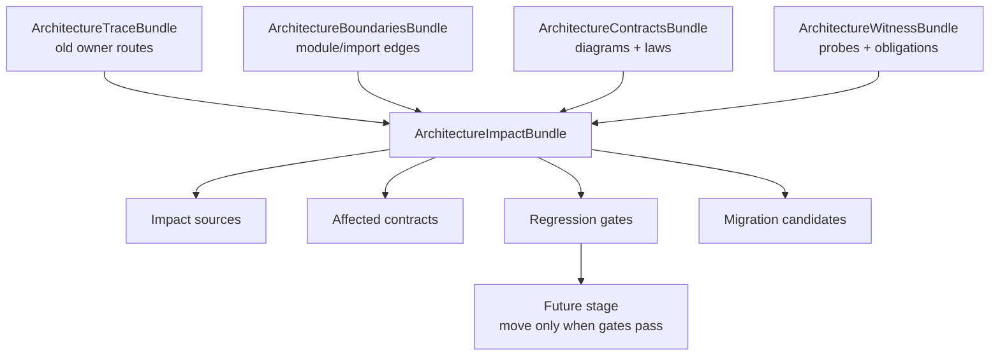

# Reta Stage-33 Architektur-Impact

## Impact-Baum

```text
ArchitectureImpactBundle
├─ ImpactSourceSpec
│  └─ old/new reta owner → capsule → category/functor/natural transformation
├─ ImpactContractSpec
│  └─ source → affected diagrams/laws/transformations → required probes
├─ RegressionGateSpec
│  └─ category/map/contract/witness/coherence/trace/boundary/impact/parity gates
├─ MigrationCandidateSpec
│  └─ future extraction candidates are guarded, not silently moved
└─ ImpactValidationSpec
   └─ Stage-33 coverage over sources, contracts, gates, capsules and naturality
```

## Mermaid


