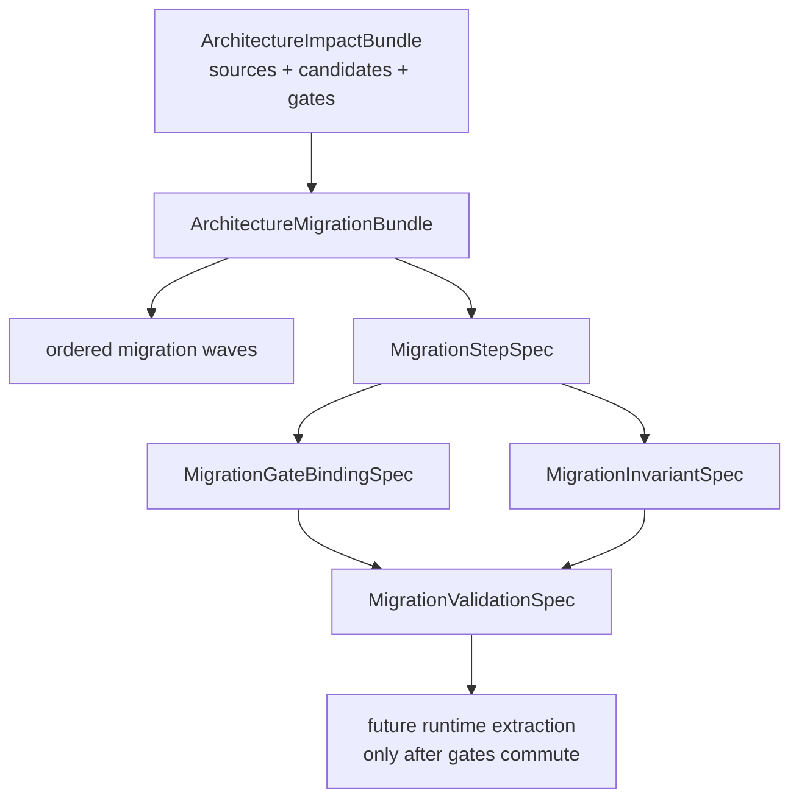

# Reta Stage-34 Architektur-Migration

## Migration-Plan-Baum

```text
ArchitectureMigrationBundle
├─ MigrationWaveSpec
│  └─ ordered capsule waves M0..M6
├─ MigrationStepSpec
│  └─ Stage-33 candidate → action → target owner → category/functor/naturality
├─ MigrationGateBindingSpec
│  └─ step → regression gates → concrete commands
├─ MigrationInvariantSpec
│  └─ wave → diagrams/laws/natural transformations that must keep commuting
└─ MigrationValidationSpec
   └─ candidate coverage, gate binding, diagram/naturality references and wave order
```

## Mermaid


