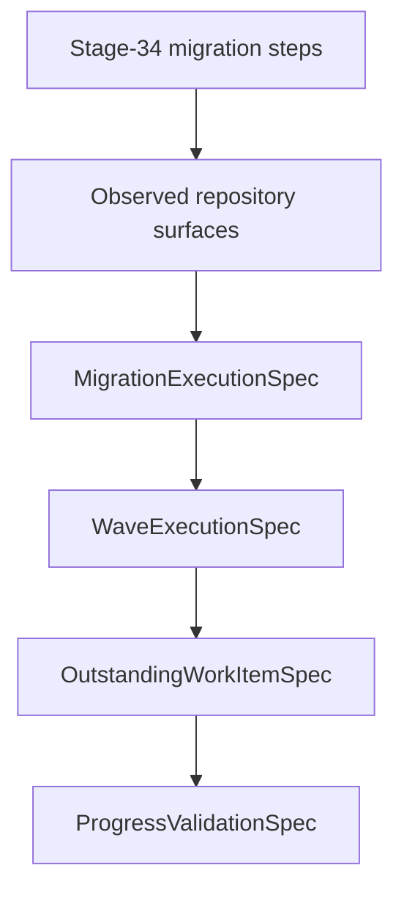

# Reta Stage-42 Architektur-Fortschritt

## Fortschrittsbaum

```text
ArchitectureProgressBundle
├─ surfaces: observed owners / facades / local sections
├─ step_progress: Stage-34 planned steps → Stage-42 execution overlay
├─ wave_progress:
│  ├─ M0: implemented_or_retained (16/16 completed, 0 outstanding)
│  ├─ M1: implemented_or_retained (4/4 completed, 0 outstanding)
│  ├─ M2: implemented_or_retained (9/9 completed, 0 outstanding)
│  ├─ M3: implemented_or_retained (1/1 completed, 0 outstanding)
│  ├─ M4: implemented_or_retained (1/1 completed, 0 outstanding)
│  ├─ M5: implemented_or_retained (1/1 completed, 0 outstanding)
│  └─ M6: implemented_or_retained (2/2 completed, 0 outstanding)
└─ outstanding_work:
   └─ WIP42-01: Restore original reference archive for command parity [environment-blocked]
```

## Mermaid


