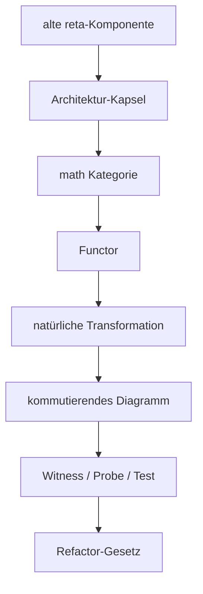

# Reta Stage-32 Architektur-Traces

## Trace-Baum

```text
ArchitectureTraceBundle
├─ legacy owner traces
│  └─ reta.py / retaPrompt.py / libs / i18n / csv / reta_architecture
├─ capsule traces
│  └─ capsule → category → functor/transformation → diagram → witness → law
└─ stage history traces
   └─ Stage 1 … Stage 32
```

## Mermaid


