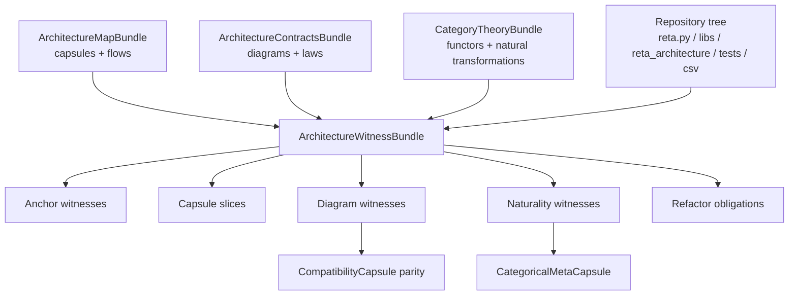

# Reta Stage-30 Architektur-Witnesses

## Witness-Baum

```text
ArchitectureWitnessBundle
├─ AnchorWitnesses: repository files / globs / symbolic owners
├─ CapsuleSlices: old reta owner → new capsule → math role → protected contract
├─ DiagramWitnesses: Stage-29 commutative diagrams with concrete evidence
├─ NaturalityWitnesses: natural transformations tied to diagrams and capsules
├─ RefactorObligations: laws future stages must preserve
└─ Validation handoff: Stage-31 validation consumes this witness matrix

Stage-30 reading:
Legacy reta surfaces are no longer the architecture source.  They are witnesses
or compatibility entrances.  The new owner is the capsule; the capsule is
protected by a contract; the contract is witnessed by concrete files, probes and
regression tests.
```

## Mermaid


