# Datenflussdiagramm für `reta_arch`

```plantuml
@startuml
left to right direction
skinparam shadowing false
skinparam componentStyle rectangle

actor Benutzer

rectangle "Eingabe" {
  component "reta.py / retaPrompt.py" as Entry
  component "prompt_runtime.py" as PromptRuntime
  component "prompt_session.py" as PromptSession
  component "input_semantics.py" as InputSemantics
  component "parameter_runtime.py" as ParameterRuntime
}

database "CSV-Dateien\ncsv/*.csv" as CSV
database "i18n-Daten\ni18n/*.py" as I18N
database "SQLite\nPersistence" as SQLite

rectangle "Architektur und Semantik" {
  component "schema.py" as Schema
  component "tag_schema.py" as TagSchema
  component "topology.py" as Topology
  component "presheaves.py" as Presheaves
  component "sheaves.py" as Sheaves
  component "semantics_builder.py" as SemanticsBuilder
  component "morphisms.py" as Morphisms
  component "universal.py" as Universal
  component "category_theory.py" as CategoryTheory
}

rectangle "Auswahl und Transformation" {
  component "row_ranges.py" as RowRanges
  component "row_filtering.py" as RowFiltering
  component "column_selection.py" as ColumnSelection
  component "generated_columns.py" as GeneratedColumns
  component "meta_columns.py" as MetaColumns
  component "number_theory.py" as NumberTheory
  component "arithmetic.py" as Arithmetic
  component "combi_join.py" as KombiJoin
  component "concat_csv.py" as ConcatCSV
}

rectangle "Tabellenverarbeitung" {
  component "table_preparation.py" as TablePreparation
  component "table_generation.py" as TableGeneration
  component "table_state.py" as TableState
  component "table_runtime.py" as TableRuntime
  component "table_wrapping.py" as TableWrapping
  component "table_output.py" as TableOutput
  component "table_adapters.py" as TableAdapters
  component "program_workflow.py" as Workflow
}

rectangle "Parallele Ausführung" {
  component "parallel_execution.py" as ParallelExecution
  component "execution_network.py" as ExecutionNetwork
}

rectangle "Ausgabe" {
  component "output_semantics.py" as OutputSemantics
  component "output_syntax.py" as OutputSyntax
  component "console_io.py" as ConsoleIO
  component "bbcode.py" as BBCode
  component "grundStrukHtml.py" as HTML
}

rectangle "Persistenz" {
  component "persistence.py" as Persistence
}

Benutzer --> Entry : Kommandozeilenargumente
Benutzer --> PromptRuntime : interaktive Eingabe

PromptRuntime --> PromptSession : Promptzustand
PromptSession --> InputSemantics : Token / Wörter / Befehle
Entry --> InputSemantics : CLI-Argumente

I18N --> InputSemantics : Sprachvokabular
Schema --> InputSemantics : erlaubte Parameter
TagSchema --> Schema : Tags und Aliasgruppen

InputSemantics --> ParameterRuntime : kanonische Parameter
ParameterRuntime --> Morphisms : normalisierte Werte

Schema --> Topology : Kontextdimensionen
Topology --> Presheaves : lokale Kontexte
Presheaves --> Sheaves : lokale Sektionen
Sheaves --> SemanticsBuilder : globale Semantik
Morphisms --> SemanticsBuilder : Transformationen
Universal --> SemanticsBuilder : Faktorisierungsregeln
CategoryTheory --> Universal : Kategorien / Funktoren

ParameterRuntime --> RowRanges : Bereichsangaben
RowRanges --> RowFiltering : konkrete Zeilenmengen

ParameterRuntime --> ColumnSelection : Spaltenparameter
ColumnSelection --> GeneratedColumns : ausgewählte Generatoren
GeneratedColumns --> NumberTheory : Primzahlen / Zahleneigenschaften
GeneratedColumns --> Arithmetic : Berechnungen
GeneratedColumns --> MetaColumns : Metadaten-Spalten

CSV --> Workflow : Haupt- und Kombi-CSV
CSV --> ConcatCSV : zusätzliche CSV-Daten
CSV --> KombiJoin : Kombinationsdaten

RowFiltering --> TablePreparation : gefilterte Zeilen
ColumnSelection --> TablePreparation : gefilterte Spalten
ConcatCSV --> TablePreparation : zusammengeführte CSV
KombiJoin --> TablePreparation : Kombi-Tabellen
GeneratedColumns --> TablePreparation : berechnete Spalten
MetaColumns --> TablePreparation : Meta-Spalten

TablePreparation --> TableGeneration : vorbereitete Tabellenstruktur
TableGeneration --> TableState : erzeugte Tabellen
TableState --> TableRuntime : Laufzeitzustand
TableRuntime --> Workflow : aktive Tabelle

Workflow --> ParallelExecution : parallelisierbare Arbeit
ParallelExecution --> ExecutionNetwork : ExecutionTask-Objekte

ExecutionNetwork --> ExecutionNetwork : FIFO / LIFO / Priority
ExecutionNetwork --> ExecutionNetwork : Worker-Prozesse
ExecutionNetwork --> ExecutionNetwork : Semaphore / Channels
ExecutionNetwork --> ParallelExecution : ExecutionResult
ParallelExecution --> Workflow : deterministisch reduzierte Ergebnisse

Workflow --> TableWrapping : Zeilen umbrechen
TableWrapping --> TableOutput : formatierbare Tabelle
TableAdapters --> TableOutput : Legacy-Adapter

ParameterRuntime --> OutputSemantics : Ausgabemodus
OutputSemantics --> OutputSyntax : Syntaxklasse auswählen
TableOutput --> OutputSyntax : Tabellenzellen

OutputSyntax --> ConsoleIO : Terminaltext
OutputSyntax --> BBCode : BBCode
OutputSyntax --> HTML : HTML
OutputSyntax --> Benutzer : CSV / Markdown / Emacs

Workflow --> Persistence : Kontext / Ausführung
Sheaves --> Persistence : Garben-Snapshot
ExecutionNetwork --> Persistence : Run-Ergebnisse
Persistence --> SQLite : speichern

SQLite --> Persistence : Cache / Snapshot laden
Persistence --> Workflow : gecachte Daten

@enduml
```



## Vereinfachter Hauptdatenfluss

```text
Benutzer
   │
   ▼
CLI / Prompt
   │
   ▼
input_semantics.py
   │
   ▼
parameter_runtime.py
   │
   ├──────────────► row_ranges.py
   │                    │
   │                    ▼
   │              row_filtering.py
   │
   ├──────────────► column_selection.py
   │                    │
   │                    ├────────► generated_columns.py
   │                    ├────────► meta_columns.py
   │                    ├────────► number_theory.py
   │                    └────────► arithmetic.py
   │
   ▼
table_preparation.py
   │
   ▼
table_generation.py
   │
   ▼
table_state.py
   │
   ▼
table_runtime.py
   │
   ▼
program_workflow.py
   │
   ├──────────────► parallel_execution.py
   │                    │
   │                    ▼
   │              execution_network.py
   │                    │
   │                    ▼
   │          deterministische Reduktion
   │
   ▼
table_wrapping.py
   │
   ▼
table_output.py
   │
   ▼
output_semantics.py
   │
   ▼
output_syntax.py
   │
   ▼
Shell / HTML / CSV / Markdown / BBCode
```

## Datenquellen

```text
CLI-Argumente
Prompt-Eingaben
CSV-Dateien
i18n-Wörter
Schema- und Tagdefinitionen
SQLite-Cache
```

## Zentrale Transformationen

```text
rohe Eingabe
→ kanonische Parameter

Bereichsangabe
→ konkrete Zeilenmenge

Spaltenparameter
→ konkrete Spaltenauswahl

CSV-Daten
→ vorbereitete Tabellen

Tabellensektionen
→ vollständige Tabelle

ExecutionTasks
→ parallele ExecutionResults
→ deterministisch geordnete Ergebnisse

Tabelle
→ Ausgabeformat
```

## Persistenzfluss

```text
ContextSelection
       │
       ▼
persistence.py
       │
       ▼
SQLite

LocalSection
       │
       ▼
persistence.py
       │
       ▼
SQLite

Sheaf-Snapshot
       │
       ▼
persistence.py
       │
       ▼
SQLite

ExecutionRun
       │
       ▼
persistence.py
       │
       ▼
SQLite

Cache-Eintrag
       │
       ▼
persistence.py
       │
       ▼
SQLite
```

## Parallelisierungsfluss

```text
Tabellenarbeit
      │
      ▼
parallel_execution.py
      │
      ▼
ExecutionTask[]
      │
      ▼
execution_network.py
      │
      ├── FIFO
      ├── LIFO
      ├── Priority Queue
      ├── Semaphore
      ├── Half-Duplex Channel
      └── Full-Duplex Channel
      │
      ▼
Worker-Prozesse
      │
      ▼
ExecutionResult[]
      │
      ▼
deterministic_reduce()
      │
      ▼
geordnete Gesamtergebnisse
```

## Kernaussage

Der zentrale Datenfluss von `reta_arch` ist:

```text
Eingabe
→ Eingabesemantik
→ Parametersemantik
→ Zeilen- und Spaltenauswahl
→ CSV- und Kombinationsdaten
→ Tabellenvorbereitung
→ Tabellengenerierung
→ optionale parallele Ausführung
→ deterministische Reduktion
→ Ausgabeformatierung
→ Terminal oder Datei
```

Die Module `topology.py`, `presheaves.py`, `sheaves.py`, `morphisms.py`, `universal.py` und `category_theory.py` bilden dabei die mathematische Architekturschicht, welche die Beziehungen und Transformationen des Datenflusses beschreibt.

