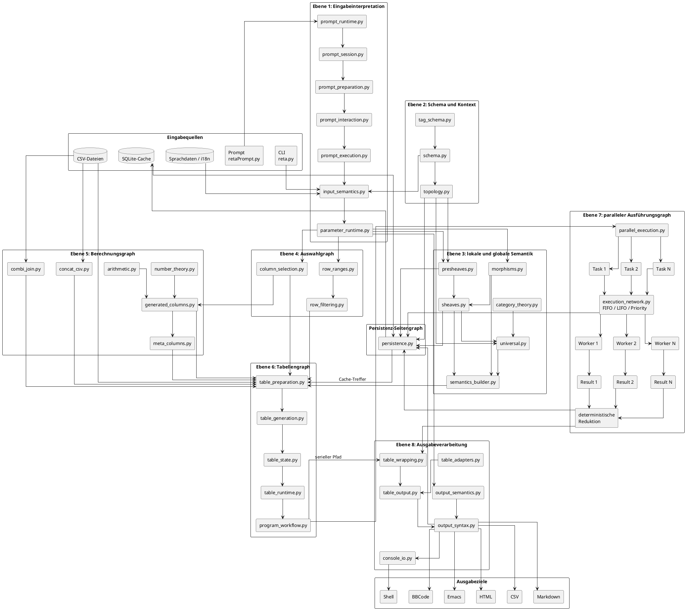

# Graph-/DAG-Diagramm für `reta_arch`

Dieses Diagramm stellt `reta_arch` als **gerichteten azyklischen Abhängigkeitsgraphen** dar.



## Vereinfachter Gesamt-DAG

```text
                         ┌──────────────┐
                         │ CLI / Prompt │
                         └──────┬───────┘
                                │
                                ▼
                     ┌─────────────────────┐
                     │ Eingabesemantik     │
                     │ input_semantics.py  │
                     └──────────┬──────────┘
                                │
                                ▼
                     ┌─────────────────────┐
                     │ Parametersemantik   │
                     │ parameter_runtime   │
                     └───┬───────────┬─────┘
                         │           │
              ┌──────────┘           └──────────┐
              ▼                                 ▼
     ┌─────────────────┐              ┌──────────────────┐
     │ Zeilenauswahl   │              │ Spaltenauswahl   │
     │ row_ranges      │              │ column_selection │
     │ row_filtering   │              └────────┬─────────┘
     └────────┬────────┘                       │
              │                     ┌──────────┼───────────┐
              │                     ▼          ▼           ▼
              │              Zahlentheorie  Arithmetik   Meta
              │                     \          |          /
              │                      \         |         /
              │                       ▼        ▼        ▼
              │                      generated_columns
              │                              │
              └───────────────┬──────────────┘
                              │
                              ▼
                       ┌─────────────┐
                       │ CSV-Daten   │
                       │ Kombi-Daten │
                       └──────┬──────┘
                              │
                              ▼
                   ┌────────────────────┐
                   │ Tabellenvorbereitung│
                   └─────────┬──────────┘
                             │
                             ▼
                   ┌────────────────────┐
                   │ Tabellengenerierung│
                   └─────────┬──────────┘
                             │
                             ▼
                    ┌───────────────────┐
                    │ Tabellenzustand   │
                    └─────────┬─────────┘
                              │
                    ┌─────────┴──────────┐
                    │                    │
                    ▼                    ▼
             serieller Pfad       paralleler Pfad
                    │                    │
                    │              ┌─────┴─────┐
                    │              ▼     ▼     ▼
                    │            Task1 Task2 TaskN
                    │              │     │     │
                    │              ▼     ▼     ▼
                    │           Worker Worker Worker
                    │              │     │     │
                    │              ▼     ▼     ▼
                    │           Result Result Result
                    │              └─────┬─────┘
                    │                    ▼
                    │          deterministische
                    │              Reduktion
                    │                    │
                    └──────────┬─────────┘
                               │
                               ▼
                      ┌─────────────────┐
                      │ Tabellenoutput  │
                      └────────┬────────┘
                               │
                               ▼
                      ┌─────────────────┐
                      │ Output-Syntax   │
                      └────────┬────────┘
                               │
             ┌─────────┬───────┼───────┬─────────┐
             ▼         ▼       ▼       ▼         ▼
           Shell      HTML     CSV   Markdown   BBCode
```

## Semantischer Teilgraph

```text
Schema
  │
  ▼
Topologie
  │
  ▼
Prägarben
  │
  ▼
Garben
  │
  ├──────────────┐
  │              │
  ▼              ▼
Morphismen   universelle
             Eigenschaften
  │              │
  └──────┬───────┘
         ▼
semantics_builder.py
         │
         ▼
globale kanonische Semantik
```

## Paralleler DAG

```text
                     Tabellenarbeit
                           │
                           ▼
                 parallel_execution.py
                           │
          ┌────────────────┼────────────────┐
          ▼                ▼                ▼
     ExecutionTask 1  ExecutionTask 2  ExecutionTask N
          │                │                │
          └────────────────┼────────────────┘
                           ▼
                 execution_network.py
                           │
          ┌────────────────┼────────────────┐
          ▼                ▼                ▼
       Worker 1         Worker 2         Worker N
          │                │                │
          ▼                ▼                ▼
       Result 1         Result 2         Result N
          │                │                │
          └────────────────┼────────────────┘
                           ▼
                deterministische Reduktion
                           │
                           ▼
                 geordnete Gesamttabelle
```

## Ebenen des DAG

| Ebene | Inhalt | Parallelisierbarkeit |
|---:|---|---|
| 1 | Eingabe und Prompt | gering |
| 2 | Schema und Topologie | meist statisch |
| 3 | Prägarben, Garben und Semantik | teilweise |
| 4 | Zeilen- und Spaltenauswahl | gut parallelisierbar |
| 5 | Zahlentheorie und generierte Spalten | sehr gut parallelisierbar |
| 6 | Tabellenvorbereitung und Generierung | teilweise |
| 7 | Tasks, Worker und Ergebnisse | explizit parallel |
| 8 | Rendering der Ausgabeformate | je Format parallel möglich |

## Warum es ein DAG ist

Der Graph ist gerichtet:

```text
Eingabe → Semantik → Auswahl → Tabelle → Ausgabe
```

Er ist azyklisch, wenn eine einzelne Programmausführung betrachtet wird:

```text
Ein Verarbeitungsschritt benötigt Ergebnisse vorheriger Schritte,
liefert aber keine Daten an einen bereits abgeschlossenen Vorgänger zurück.
```

Cache-Lesen und Persistenz sind dabei Seitengraphen. Sie dürfen nicht als Rückkopplung innerhalb derselben Berechnung interpretiert werden:

```text
frühere Ausführung
      │
      ▼
SQLite-Cache
      │
      ▼
neue Ausführung
```

## Zentrale Faktorisierung

Der Gesamtablauf wird in Teilmorphismen zerlegt:

```text
f =
Ausgabe
∘ Rendering
∘ Reduktion
∘ Ausführung
∘ Tabellengenerierung
∘ Auswahl
∘ Semantikbildung
∘ Eingabeinterpretation
```

Der DAG erweitert diese reine Kette um unabhängige parallele Zweige:

```text
                     ┌→ Zeilenauswahl ─────┐
Parametersemantik ───┼→ Spaltenauswahl ────┼→ Tabelle
                     ├→ generierte Spalten ┤
                     └→ Kombinationsdaten ─┘
```

Damit ist der `reta_arch`-Ablauf nicht bloß eine Pipeline, sondern eine Kombination aus:

```text
Pipeline
+ Verzweigungen
+ Diamanten
+ Parallelitätsgraphen
+ deterministischer Zusammenführung
```
