# Frage

Kannst du von `reta_arch` ein UML-Klassenmodell der wichtigsten Klassen und deren Ableitungen aufstellen?

# Antwort

Ja. Hier ist ein **PlantUML-Klassenmodell** der wichtigsten Klassen von `reta_arch`:

```plantuml
@startuml
skinparam classAttributeIconSize 0

package "Topology" {
  class ContextSelection
  class ContextDimension
  class RetaContextTopology

  RetaContextTopology --> ContextDimension
  RetaContextTopology --> ContextSelection
  ContextSelection --> ContextSelection : refine()
}

package "Presheaves" {
  class LocalSection
  class Presheaf
  class FilesystemPresheaf
  class PromptStatePresheaf
  class PresheafBundle

  Presheaf <|-- FilesystemPresheaf
  Presheaf <|-- PromptStatePresheaf
  Presheaf *-- LocalSection
  PresheafBundle *-- FilesystemPresheaf : csv
  PresheafBundle *-- FilesystemPresheaf : translations
  PresheafBundle *-- FilesystemPresheaf : assets
  PresheafBundle *-- PromptStatePresheaf
  LocalSection --> ContextSelection
}

package "Sheaves" {
  class ParameterSemanticsSheaf
  class GeneratedColumnsSheaf
  class TableOutputSheaf
  class HtmlReferenceSheaf
  class SheafBundle

  SheafBundle *-- ParameterSemanticsSheaf
  SheafBundle *-- GeneratedColumnsSheaf
  SheafBundle *-- TableOutputSheaf
  SheafBundle *-- HtmlReferenceSheaf
  ParameterSemanticsSheaf --> RetaContextTopology
}

package "Category Theory" {
  class CategoryObjectSpec
  class CategoryMorphismSpec
  class CategorySpec
  class FunctorSpec
  class NaturalTransformationSpec
  class ParadigmTermSpec
  class CategoryTheoryBundle

  CategorySpec *-- CategoryObjectSpec
  CategorySpec *-- CategoryMorphismSpec
  CategoryTheoryBundle *-- CategorySpec
  CategoryTheoryBundle *-- FunctorSpec
  CategoryTheoryBundle *-- NaturalTransformationSpec
  CategoryTheoryBundle *-- ParadigmTermSpec
}

package "Universal / Morphisms" {
  class UniversalBundle
  class MorphismBundle
  class AliasMorphisms
  class RangeMorphisms
  class PromptMorphisms
  class RendererMorphisms

  UniversalBundle --> SheafBundle
  MorphismBundle *-- AliasMorphisms
  MorphismBundle *-- RangeMorphisms
  MorphismBundle *-- PromptMorphisms
  MorphismBundle *-- RendererMorphisms
}

package "Output Syntax" {
  class OutputSyntax
  class NichtsSyntax
  class csvSyntax
  class emacsSyntax
  class markdownSyntax
  class bbCodeSyntax
  class htmlSyntax

  OutputSyntax <|-- csvSyntax
  OutputSyntax <|-- emacsSyntax
  OutputSyntax <|-- markdownSyntax
  OutputSyntax <|-- bbCodeSyntax
  OutputSyntax <|-- htmlSyntax
}

package "Tables" {
  class Tables
  class Maintable
  class TableRuntimeBundle
  class TableGenerationBundle
  class TableGenerationResult
  class TablePreparationBundle
  class MainTablePreparationResult
  class KombiTablePreparationResult
  class TableStateBundle
  class TableStateSections
  class TableDisplayState
  class GeneratedColumnSection
  class TableOutput
  class TableOutputBundle

  TableRuntimeBundle --> Tables
  TableRuntimeBundle --> TableStateBundle
  TableGenerationBundle --> TableGenerationResult
  TablePreparationBundle --> MainTablePreparationResult
  TablePreparationBundle --> KombiTablePreparationResult
  TableStateBundle --> TableStateSections
  TableStateSections *-- TableDisplayState
  TableStateSections *-- GeneratedColumnSection
  TableOutputBundle --> TableOutput
}

package "Execution Network" {
  class ExecutionTask
  class ExecutionResult
  class ExecutionNetworkConfig
  class ExecutionNetworkBundle
  class FifoTaskQueue
  class LifoTaskStack
  class PriorityTaskQueue
  class ResourceSemaphore
  class HalfDuplexChannel
  class FullDuplexChannel

  ExecutionNetworkBundle *-- ExecutionNetworkConfig
  ExecutionNetworkBundle *-- FifoTaskQueue
  ExecutionNetworkBundle *-- LifoTaskStack
  ExecutionNetworkBundle *-- PriorityTaskQueue
  ExecutionNetworkBundle *-- ResourceSemaphore
  ExecutionNetworkBundle *-- HalfDuplexChannel
  ExecutionNetworkBundle *-- FullDuplexChannel

  FifoTaskQueue --> ExecutionTask
  LifoTaskStack --> ExecutionTask
  PriorityTaskQueue --> ExecutionTask
  ExecutionResult --> ExecutionTask
}

package "Persistence" {
  class PersistenceConfig
  class PersistenceBundle

  PersistenceBundle *-- PersistenceConfig
  PersistenceBundle --> ContextSelection
  PersistenceBundle --> LocalSection
}

package "Schema / Tags" {
  class AliasGroup
  class RetaContextSchema
  enum ST

  RetaContextSchema *-- AliasGroup
  RetaContextTopology --> RetaContextSchema
}

package "Prompt / Completion" {
  class PromptRuntimeBundle
  class PromptRuntimeBuilder
  class PromptLanguageBundle
  class PromptSessionBundle
  class PromptTextState
  class PromptSession
  class ToggleHistory
  class ArchitectureWordCompleter
  class ArchitectureNestedCompleter

  PromptRuntimeBuilder --> PromptRuntimeBundle
  PromptSessionBundle --> PromptTextState
  PromptSessionBundle --> PromptLanguageBundle
  PromptSession --> PromptSessionBundle
}

package "Enums / Exceptions" {
  enum PromptModus
  enum Wraptype
  enum nPmEnum
  class BreakoutException
}

@enduml
```



## Wichtigste echte Vererbungen im Code

```text
Presheaf
├── FilesystemPresheaf
└── PromptStatePresheaf

OutputSyntax
├── csvSyntax
├── emacsSyntax
├── markdownSyntax
├── bbCodeSyntax
└── htmlSyntax

Enum
├── ST
├── Wraptype
└── PromptModus

IntEnum
└── nPmEnum

Exception
└── BreakoutException
```

Die meisten anderen Klassen sind **Dataclass-, Spec- oder Bundle-Klassen**, die überwiegend **Komposition** statt **Vererbung** verwenden.
