i# UML-Komponentendiagramm für `reta_arch`

```plantuml
@startuml
left to right direction

skinparam componentStyle rectangle
skinparam shadowing false
skinparam linetype ortho

actor Benutzer

package "Benutzerschnittstellen" {
  component "CLI\nreta.py" as CLI
  component "Interaktiver Prompt\nretaPrompt.py" as Prompt
  component "Prompt Runtime\nprompt_runtime.py" as PromptRuntime
  component "Prompt Session\nprompt_session.py" as PromptSession
}

package "Eingabe und Parameter" {
  component "Input Semantics\ninput_semantics.py" as InputSemantics
  component "Parameter Runtime\nparameter_runtime.py" as ParameterRuntime
  component "Schema\nschema.py" as Schema
  component "Tag Schema\ntag_schema.py" as TagSchema
  component "Sprachdaten\ni18n" as I18N
}

package "Mathematische Architekturschicht" {
  component "Topology\ntopology.py" as Topology
  component "Presheaves\npresheaves.py" as Presheaves
  component "Sheaves\nsheaves.py" as Sheaves
  component "Morphisms\nmorphisms.py" as Morphisms
  component "Universal Properties\nuniversal.py" as Universal
  component "Category Theory\ncategory_theory.py" as CategoryTheory
  component "Semantics Builder\nsemantics_builder.py" as SemanticsBuilder
}

package "Zeilen- und Spaltenverarbeitung" {
  component "Row Ranges\nrow_ranges.py" as RowRanges
  component "Row Filtering\nrow_filtering.py" as RowFiltering
  component "Column Selection\ncolumn_selection.py" as ColumnSelection
}

package "Berechnungen und Generatoren" {
  component "Generated Columns\ngenerated_columns.py" as GeneratedColumns
  component "Meta Columns\nmeta_columns.py" as MetaColumns
  component "Number Theory\nnumber_theory.py" as NumberTheory
  component "Arithmetic\narithmetic.py" as Arithmetic
  component "CSV Concatenation\nconcat_csv.py" as ConcatCSV
  component "Combination Join\ncombi_join.py" as CombiJoin
}

package "Tabellenkern" {
  component "Table Preparation\ntable_preparation.py" as TablePreparation
  component "Table Generation\ntable_generation.py" as TableGeneration
  component "Table State\ntable_state.py" as TableState
  component "Table Runtime\ntable_runtime.py" as TableRuntime
  component "Program Workflow\nprogram_workflow.py" as Workflow
  component "Table Wrapping\ntable_wrapping.py" as TableWrapping
  component "Table Output\ntable_output.py" as TableOutput
  component "Table Adapters\ntable_adapters.py" as TableAdapters
}

package "Ausführungsnetzwerk" {
  component "Parallel Execution\nparallel_execution.py" as ParallelExecution
  component "Execution Network\nexecution_network.py" as ExecutionNetwork
  component "Task Queues\nFIFO / LIFO / Priority" as Queues
  component "Worker Pool" as Workers
  component "Channels\nHalf-/Full-Duplex" as Channels
  component "Resource Semaphores" as Semaphores
  component "Deterministic Reduction" as Reduction
}

package "Ausgabe" {
  component "Output Semantics\noutput_semantics.py" as OutputSemantics
  component "Output Syntax\noutput_syntax.py" as OutputSyntax
  component "Console I/O\nconsole_io.py" as ConsoleIO
  component "HTML Renderer\ngrundStrukHtml.py" as HTMLRenderer
  component "BBCode Renderer\nbbcode.py" as BBCodeRenderer
  component "CSV Renderer" as CSVRenderer
  component "Markdown Renderer" as MarkdownRenderer
  component "Emacs Renderer" as EmacsRenderer
}

package "Persistenz" {
  component "Persistence Service\npersistence.py" as Persistence
  database "SQLite" as SQLite
  component "Cache" as Cache
  component "Snapshots" as Snapshots
  component "Audit Log" as Audit
}

package "Externe Daten" {
  database "Haupt-CSV" as MainCSV
  database "Kombi-CSV" as KombiCSV
  database "Übersetzungsdaten" as TranslationData
  database "Assets" as Assets
}

Benutzer --> CLI : Kommando
Benutzer --> Prompt : interaktive Eingabe

Prompt --> PromptRuntime
PromptRuntime --> PromptSession
PromptSession --> InputSemantics

CLI --> InputSemantics

TagSchema --> Schema
Schema --> InputSemantics
I18N --> InputSemantics
TranslationData --> I18N

InputSemantics --> ParameterRuntime

Schema --> Topology
ParameterRuntime --> Topology
ParameterRuntime --> Morphisms

Topology --> Presheaves
Presheaves --> Sheaves
Morphisms --> Sheaves

CategoryTheory --> Universal
Topology --> Universal
Sheaves --> Universal

Sheaves --> SemanticsBuilder
Morphisms --> SemanticsBuilder
Universal --> SemanticsBuilder

ParameterRuntime --> RowRanges
RowRanges --> RowFiltering

ParameterRuntime --> ColumnSelection
ColumnSelection --> GeneratedColumns

NumberTheory --> GeneratedColumns
Arithmetic --> GeneratedColumns
GeneratedColumns --> MetaColumns

MainCSV --> ConcatCSV
KombiCSV --> CombiJoin
MainCSV --> TablePreparation
KombiCSV --> TablePreparation

ConcatCSV --> TablePreparation
CombiJoin --> TablePreparation
RowFiltering --> TablePreparation
ColumnSelection --> TablePreparation
GeneratedColumns --> TablePreparation
MetaColumns --> TablePreparation
SemanticsBuilder --> TablePreparation

TablePreparation --> TableGeneration
TableGeneration --> TableState
TableState --> TableRuntime
TableRuntime --> Workflow

Workflow --> ParallelExecution
ParallelExecution --> ExecutionNetwork

ExecutionNetwork --> Queues
ExecutionNetwork --> Workers
ExecutionNetwork --> Channels
ExecutionNetwork --> Semaphores

Queues --> Workers
Channels --> Workers
Semaphores --> Workers
Workers --> Reduction

Reduction --> Workflow

Workflow --> TableWrapping
TableWrapping --> TableOutput
TableAdapters --> TableOutput

ParameterRuntime --> OutputSemantics
OutputSemantics --> OutputSyntax
TableOutput --> OutputSyntax

OutputSyntax --> ConsoleIO
OutputSyntax --> HTMLRenderer
OutputSyntax --> BBCodeRenderer
OutputSyntax --> CSVRenderer
OutputSyntax --> MarkdownRenderer
OutputSyntax --> EmacsRenderer

ConsoleIO --> Benutzer
HTMLRenderer --> Benutzer
BBCodeRenderer --> Benutzer
CSVRenderer --> Benutzer
MarkdownRenderer --> Benutzer
EmacsRenderer --> Benutzer

Topology --> Persistence
Presheaves --> Persistence
Sheaves --> Persistence
ExecutionNetwork --> Persistence
Reduction --> Persistence
OutputSyntax --> Persistence

Persistence --> Cache
Persistence --> Snapshots
Persistence --> Audit

Cache --> SQLite
Snapshots --> SQLite
Audit --> SQLite

SQLite --> Persistence
Persistence --> TablePreparation : Cache-Daten

Assets --> HTMLRenderer
Assets --> BBCodeRenderer

@enduml
```



## Vereinfachte Komponentenübersicht

```text
┌─────────────────────────┐
│ Benutzerschnittstellen  │
│ CLI / Prompt            │
└────────────┬────────────┘
             │
             ▼
┌─────────────────────────┐
│ Eingabe und Parameter   │
│ Schema / Semantik       │
└────────────┬────────────┘
             │
             ▼
┌─────────────────────────┐
│ Mathematische           │
│ Architekturschicht      │
│                        │
│ Topologie              │
│ Prägarben              │
│ Garben                 │
│ Morphismen             │
│ universelle Eigenschaften│
└────────────┬────────────┘
             │
             ▼
┌─────────────────────────┐
│ Zeilen- und             │
│ Spaltenverarbeitung     │
└────────────┬────────────┘
             │
             ▼
┌─────────────────────────┐
│ Berechnungen und        │
│ generierte Spalten      │
└────────────┬────────────┘
             │
             ▼
┌─────────────────────────┐
│ Tabellenkern            │
└───────┬─────────┬───────┘
        │         │
        │         ▼
        │  ┌──────────────────┐
        │  │ Ausführungsnetz  │
        │  │ Tasks / Worker   │
        │  │ Reduktion        │
        │  └────────┬─────────┘
        │           │
        └───────────┘
             │
             ▼
┌─────────────────────────┐
│ Ausgabe                 │
│ Shell / HTML / CSV      │
│ Markdown / BBCode       │
└────────────┬────────────┘
             │
             ▼
          Benutzer
```

## Hauptkomponenten

| Komponente                       | Aufgabe                                                                   |
| -------------------------------- | ------------------------------------------------------------------------- |
| Benutzerschnittstellen           | CLI- und Prompt-Eingaben entgegennehmen                                   |
| Eingabe und Parameter            | Eingaben interpretieren und normalisieren                                 |
| Mathematische Architekturschicht | Kontexte, lokale Daten, globale Semantik und Transformationen beschreiben |
| Zeilenverarbeitung               | Bereichsangaben in konkrete Zeilenmengen umsetzen                         |
| Spaltenverarbeitung              | gewünschte Spalten auswählen                                              |
| Berechnungen                     | Zahlentheorie, Arithmetik und generierte Spalten berechnen                |
| Tabellenkern                     | Tabellen vorbereiten, erzeugen und verwalten                              |
| Ausführungsnetzwerk              | Tasks parallel verteilen und Ergebnisse reduzieren                        |
| Ausgabe                          | Tabellen in verschiedene Formate rendern                                  |
| Persistenz                       | Cache, Snapshots und Audit-Daten speichern                                |

## Komponentenabhängigkeiten

```text
Benutzerschnittstellen
        │
        ▼
Eingabe und Parameter
        │
        ▼
Mathematische Architekturschicht
        │
        ▼
Zeilen- und Spaltenverarbeitung
        │
        ▼
Berechnungen und Generatoren
        │
        ▼
Tabellenkern
        │
        ├────────► Ausführungsnetzwerk
        │                  │
        │◄─────────────────┘
        │
        ▼
Ausgabe
        │
        ▼
Benutzer
```

## Persistenz als Querschnittskomponente

```text
Topologie ───────────────┐
Prägarben ───────────────┤
Garben ──────────────────┤
Ausführungsnetzwerk ─────┤
Reduktion ───────────────┤
Ausgabe ─────────────────┤
                         ▼
                    Persistenz
                         │
                         ▼
                       SQLite
```

## Parallele Ausführungskomponenten

```text
Program Workflow
       │
       ▼
Parallel Execution
       │
       ▼
Execution Network
       │
       ├── Task Queues
       ├── Worker Pool
       ├── Channels
       └── Semaphores
              │
              ▼
     Deterministic Reduction
              │
              ▼
       Program Workflow
```

## Ausgabe-Komponenten

```text
Table Output
      │
      ▼
Output Semantics
      │
      ▼
Output Syntax
      │
      ├── Console I/O
      ├── HTML Renderer
      ├── CSV Renderer
      ├── Markdown Renderer
      ├── BBCode Renderer
      └── Emacs Renderer
```

## Kernaussage

Das Komponentendiagramm zeigt `reta_arch` als Schichtenarchitektur mit einem seitlich angeschlossenen Ausführungsnetzwerk und einer querschneidenden Persistenzkomponente:

```text
Eingabe
→ Semantik
→ mathematische Architektur
→ Auswahl und Berechnung
→ Tabellenkern
→ Parallelisierung
→ Rendering
→ Ausgabe
```

