# UML-Paketdiagramm für `reta_arch`

```plantuml
@startuml
skinparam packageStyle rectangle
skinparam shadowing false

package "reta_architecture" {

  package "Schema / Tags" as schema {
    [schema.py]
    [tag_schema.py]
    [alias_schema.py]
  }

  package "Topology" as topology {
    [topology.py]
  }

  package "Morphism Layer" as morphisms {
    [morphisms.py]
  }

  package "Category Theory" as category {
    [category_theory.py]
    [functors.py]
    [natural_transformations.py]
    [universal_properties.py]
  }

  package "Presheaves" as presheaves {
    [presheaves.py]
  }

  package "Sheaves" as sheaves {
    [sheaves.py]
  }

  package "Workflow / Tables" as workflow {
    [program_workflow.py]
    [table_runtime.py]
    [table_generation.py]
    [table_state.py]
    [table_output.py]
  }

  package "Execution Network" as execution {
    [execution_network.py]
    [scheduler.py]
    [queues.py]
    [channels.py]
  }

  package "Persistence" as persistence {
    [persistence.py]
  }

  package "Rendering / Output" as rendering {
    [rendering.py]
    [output_syntax.py]
    [html_output.py]
    [csv_output.py]
    [markdown_output.py]
    [bbcode_output.py]
  }

  package "Prompt / Completion" as prompt {
    [prompt_runtime.py]
    [prompt_session.py]
    [word_completion.py]
    [nested_completion.py]
  }

  package "Architecture Validation" as validation {
    [architecture_map.py]
    [architecture_boundaries.py]
    [architecture_coherence.py]
    [architecture_trace.py]
    [architecture_validation.py]
    [architecture_migration.py]
  }

  package "Legacy Facade" as legacy {
    [reta.py]
    [center.py]
    [tableHandling.py]
    [libs/*]
  }
}

schema --> topology : liefert Werte / Dimensionen
schema --> morphisms : Aliasgruppen

topology --> presheaves : lokale Kontexte
topology --> sheaves : Kontext der globalen Semantik
topology --> category : OpenRetaContextCategory

presheaves --> sheaves : Gluing
sheaves --> workflow : kanonische Semantik
morphisms --> sheaves : Alias / Range / Prompt
morphisms --> workflow : Spalten / Tabellenparameter

category --> topology : Kategorien über Kontexten
category --> presheaves : LocalSectionCategory
category --> sheaves : CanonicalSemanticSheafCategory
category --> workflow : TableSectionCategory
category --> rendering : OutputFormatCategory
category --> execution : ExecutionNetworkCategory
category --> persistence : PersistenceCategory

workflow --> execution : Chunking / Tasks
execution --> workflow : Results / deterministic_reduce

workflow --> rendering : Tabellen ausgeben
rendering --> persistence : optional Snapshots / Audit

prompt --> presheaves : PromptStatePresheaf
prompt --> morphisms : PromptMorphisms

persistence --> topology : speichert ContextSelection
persistence --> presheaves : speichert LocalSection
persistence --> sheaves : speichert SheafSnapshots
persistence --> execution : speichert Runs / Cache / Audit

validation --> category : prüft Diagramme / Verträge
validation --> legacy : Migrationspfade
validation --> persistence : Audit / Trace

legacy --> morphisms : Delegation
legacy --> workflow : alte Tabellenlogik
legacy --> rendering : alte Ausgabe
legacy --> prompt : alte Prompt-Kompatibilität

@enduml
```



## Kurzinterpretation

```text
Schema / Tags
    ↓
Topology
    ↓
Presheaves
    ↓
Sheaves
    ↓
Workflow / Tables
    ↓
Rendering / Output
```

Parallel dazu:

```text
Workflow / Tables
    ↓
Execution Network
    ↓
Workflow / Tables
```

Und quer dazu:

```text
Category Theory
    verbindet / beschreibt alle Schichten

Persistence
    speichert Kontexte, Sektionen, Garben, Runs, Cache, Audit

Architecture Validation
    prüft Grenzen, Migration, Kohärenz und Trace

Legacy Facade
    hält alte reta-Schnittstellen kompatibel
```

## Wichtigste Paketabhängigkeiten

| Von | Nach | Bedeutung |
|---|---|---|
| `schema` | `topology` | Schema liefert erlaubte Kontextwerte |
| `topology` | `presheaves` | Kontexte lokaler Sektionen |
| `presheaves` | `sheaves` | lokale Daten werden geklebt |
| `sheaves` | `workflow` | globale Semantik erzeugt Tabellen |
| `workflow` | `rendering` | Tabellen werden ausgegeben |
| `workflow` | `execution` | Tabellenarbeit wird in Tasks zerlegt |
| `execution` | `workflow` | Ergebnisse werden deterministisch reduziert |
| `persistence` | `sheaves` | Garben-Snapshots werden gespeichert |
| `category` | alle Kernpakete | Kategorien, Funktoren, natürliche Transformationen |
| `validation` | `category` | Architekturdiagramme werden geprüft |
| `legacy` | `workflow` | alte reta-Pfade delegieren in neue Architektur |
